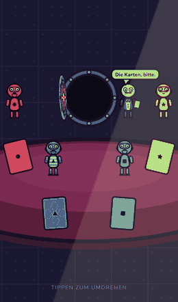

# 🔓 Der Tresor

Ein Mobile-First Pass-the-Phone-Trinkspiel über Vertrauen und Verrat für 3–8 Personen. Ein Tresor voller Schlücke, 30 Sekunden Verhandlung, dann entscheidet jeder geheim: **Teilen oder Stehlen**. Teilen alle, trinkt niemand und der Tresor wächst. Stiehlt einer, verteilt er alles. Stehlen mehrere, saufen die Diebe den Tresor unter sich aus.

Schwesterprojekt von [Drinkshot](https://github.com/lukabpunkt/Drinkshot) — gleicher Stack, gleiche Design-Sprache, gleiche Charaktere.

<p align="center">
  
</p>

**[Spielen →](https://lukabpunkt.github.io/Tresor/)** · kein Backend, kein Konto, offline spielbar.

**Status:** Release-Kandidat (`v1.0.0-rc.1`) — vollständig spielbar. Elf Ergebnis-Inszenierungen, fünf Modi, DE/EN, PWA. Lighthouse Mobile: Performance 99 · Accessibility 100 · Best Practices 100. Was zu 1.0 fehlt, ist der Playtest mit einer echten Gruppe ([`docs/PLAYTEST-01.md`](docs/PLAYTEST-01.md)) und das Balancing, das davon abhängt. Aktueller Stand in [`docs/PROGRESS.md`](docs/PROGRESS.md).

## Entwickeln

```bash
npm install
npm run dev            # Vite mit --host, auch vom Handy im WLAN erreichbar
```

| Befehl                                                | Was er tut                                               |
| ----------------------------------------------------- | -------------------------------------------------------- |
| `npm run dev` · `build` · `preview`                   | Entwicklung, Produktions-Build, lokale Vorschau          |
| `npm run typecheck` · `lint` · `format`               | TypeScript strict, ESLint, Prettier                      |
| `npm test`                                            | typecheck + lint + Unit-Tests                            |
| `npm run test:unit` · `test:coverage`                 | Vitest (Schwellen: `core/` ≥ 95 %, `fsm.ts` = 100 %)     |
| `npm run test:e2e` · `test:perf`                      | Playwright: Flow, A11y, Resilienz · Perf-Budget           |
| `npm run build:atlas` · `build:audio` · `build:icons` | Assets aus `assets-src/` bzw. `audio-src/`               |
| `npm run check:colors`                                | Farb-Audit: Deuteranopie/Protanopie über CIE Lab (A2)    |
| `npm run check:bundle`                                | Bundle-Budget nach `npm run build` (A5)                  |
| `npm run preview:outcomes`                            | Jede Inszenierung und jedes Overlay einzeln abspielen    |

## Aufbau

Die Spiellogik ist eine reine Funktion und lebt vollständig in `src/core/`:

| Modul                                           | Verantwortung                                                                          |
| ----------------------------------------------- | -------------------------------------------------------------------------------------- |
| [`payout.ts`](src/core/payout.ts)               | `resolveRound()` — entscheidet die Runde. Genau einmal, beim Übergang SEALED → REVEAL. |
| [`vault.ts`](src/core/vault.ts)                 | Tresor-Ökonomie: Wachstum, Deckel, Bankgebühr, Jackpot                                 |
| [`modes.ts`](src/core/modes.ts)                 | Maulwurf (`crypto`), Eid, Nachtschicht                                                 |
| [`choreographer.ts`](src/core/choreographer.ts) | Reveal-Reihenfolge und Timing der Show — Teiler zuerst, Diebe zuletzt                  |
| [`fsm.ts`](src/core/fsm.ts)                     | Zustandsmaschine des Spiels                                                            |
| [`session.ts`](src/core/session.ts)             | Scoreboard, Vertrauens-Index, Verrats-Streak, Persistenz                               |

Die Show (`src/game/`) liest dieses Ergebnis und inszeniert es — sie würfelt nichts.

Darüber liegt die UI: ein Router mit zehn Screens (`src/ui/screens/`) und die Komponenten
(`src/ui/components/`) — Tresor-Widget mit Split-Flap-Zähler, Countdown-Ring,
Entscheidungskarten, Badges mit Eid-Siegel. Menüs sind DOM.

Die Aufdeckung ist eine PixiJS-Bühne (`src/game/`): `VaultRoom` baut und besitzt den
Raum samt Tresor, Crooks, Karten und Herrn Kassel; `StageApp` hält das PIXI-Singleton
und lässt den Ticker GSAP treiben. Der Chunk lädt erst während der Verhandlung
(ADR-15), und drei Atlanten entlang der Zeichenreihenfolge ergeben zwei Draw-Calls
(ADR-14).

Die Show selbst führt der `RevealDirector`: Er macht aus dem `RevealScript` **eine**
GSAP-Timeline — Kamerafahrten, Blick-Regie, Trommelwirbel, Alarm, Slow-Mo bei der
letzten Karte. Entschieden hat er nichts; das Ergebnis stand fest, bevor er anfing.
Die Sounds synthetisiert der `AudioManager` zur Laufzeit (ADR-19).

## Gerätematrix

Die E2E-Suite läuft gegen vier Profile. Primär sind die beiden Handys — sie fahren jede
Suite und das Perf-Budget. iPad und Desktop laufen nur den Spielfluss: Dort geht es um
Layout im Portrait-Rahmen, nicht um Bildraten.

| Profil          | Engine    | Suiten                          |
| --------------- | --------- | ------------------------------- |
| iPhone 12       | WebKit    | Flow · A11y · Resilienz · Perf  |
| Pixel 5         | Chromium  | Flow · A11y · Resilienz · Perf  |
| iPad Mini       | WebKit    | Flow                            |
| Desktop Chrome  | Chromium  | Flow                            |

Referenzgeräte für die Handmessung bleiben iPhone 11 (Safari) und Pixel 4a (Chrome):
60 fps Ziel, 30 fps Minimum im Low-Effects-Modus.

## Veröffentlichen

```bash
npm run build                 # tsc --noEmit && vite build  →  dist/
npm run check:bundle          # Budget: Einstieg ≤ 40 KB, gesamt ≤ 450 KB gzip
```

Deploy auf GitHub Pages aus `dist/`, `base` ist `/Tresor/`. Für einen anderen Pfad
`TRESOR_BASE` setzen. Der Service Worker meldet neue Versionen als Toast; erzwungen wird
nichts — mitten in einer Runde neu zu laden würde die Runde wegwerfen.

Versionen und Änderungen stehen in [`CHANGELOG.md`](CHANGELOG.md).

## Lizenz

Alle Rechte vorbehalten — siehe [`LICENSE`](LICENSE). Das ist bewusst die zurücknehmbare
Entscheidung: Ein Projekt lässt sich später öffnen, der umgekehrte Weg praktisch nicht.

## Planung

| Dokument                                                                          | Inhalt                                                                                               |
| --------------------------------------------------------------------------------- | ---------------------------------------------------------------------------------------------------- |
| [`CLAUDE.md`](CLAUDE.md)                                                          | Arbeitsanweisungen für Claude Code                                                                   |
| [`docs/01-GDD.md`](docs/01-GDD.md)                                                | Game Design Document — Regeln, Tresor-Ökonomie, Auszahlung, Modi, Reveal-Dramaturgie, Inszenierungen |
| [`docs/02-ART-DIRECTION.md`](docs/02-ART-DIRECTION.md)                            | Art Direction — Heist-Look, Tokens, Crooks, Karten, Bühne                                            |
| [`docs/03-ARCHITECTURE.md`](docs/03-ARCHITECTURE.md)                              | Architektur — Stack, Struktur, FSM, Datenmodell, Payout-Spezifikation                                |
| [`docs/04-ROADMAP.md`](docs/04-ROADMAP.md)                                        | Meilensteine M0–M6                                                                                   |
| [`docs/05-AUDITS.md`](docs/05-AUDITS.md)                                          | Audits A0–A6                                                                                         |
| [`docs/PROGRESS.md`](docs/PROGRESS.md) · [`docs/DECISIONS.md`](docs/DECISIONS.md) | Fortschritt · ADR-Log                                                                                |
| [`docs/PLAYTEST-01.md`](docs/PLAYTEST-01.md)                                      | Protokollbogen für den Playtest-Abend (Audit A6)                                                     |

## Stack

Vite 6 · TypeScript 5 strict · PixiJS v8 · GSAP 3 · howler.js · vite-plugin-pwa · Vitest · Playwright · GitHub Pages (`base: '/Tresor/'`)

Kein Backend, keine Analytics, keine externen Requests zur Laufzeit.
