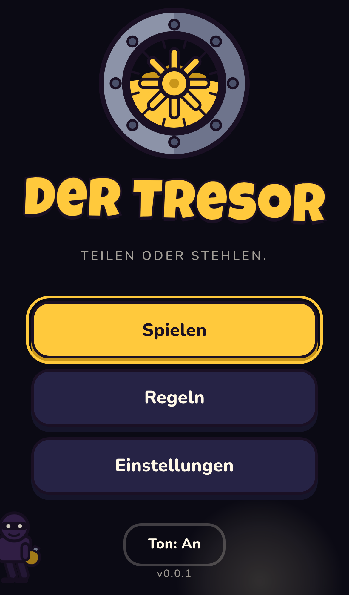
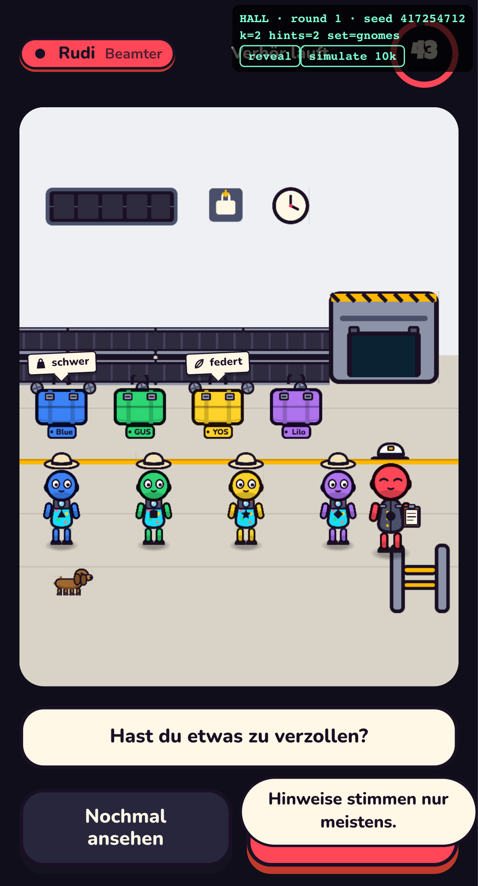
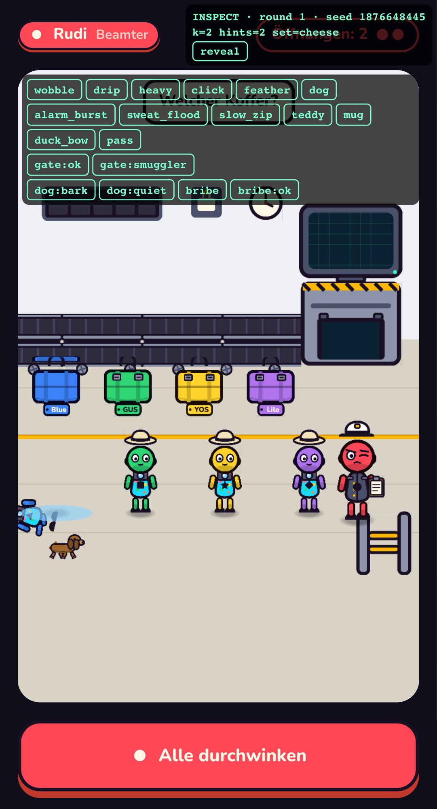
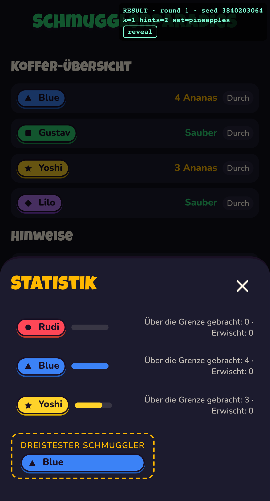
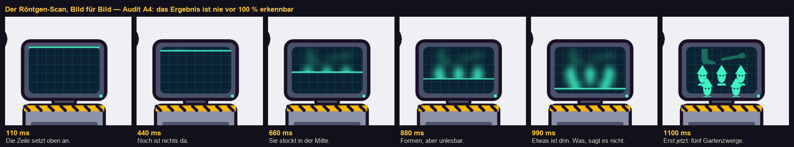

# 🛃 Der Zoll

Ein Mobile-First Pass-the-Phone-Bluffspiel für 4–8 Personen. Alle sind Reisende mit einem Koffer — bis auf den Zollbeamten. Jeder packt heimlich saubere Ware oder 1–6 Stück Schmuggelware. Der Beamte bekommt unzuverlässige Hinweise, verhört alle, öffnet zwei Koffer im Röntgengerät. Erwischt: doppelt trinken. Durchgekommen: verteilen. Unschuldig belästigt: der Beamte trinkt.

Schwesterprojekt von [Drinkshot](https://github.com/lukabpunkt/Drinkshot), [Der Tresor](https://github.com/lukabpunkt/Tresor) und [Sprengmeister](https://github.com/lukabpunkt/Sprengmeister) — gleicher Stack, gleiche Design-Sprache, gleiche Charaktere.

**Spielen:** https://lukabpunkt.github.io/Zoll/ — Handy in die Mitte, los.

**Status:** Veröffentlicht und spielbar. Fehlt für 1.0 nur noch der Playtest mit echten
Menschen (`docs/PLAYTEST-01.md`) und der Balancing-Pass danach.

| | |
|---|---|
| Lighthouse Mobile | Performance **99** · Accessibility **100** · Best Practices **100** |
| Bundle | 251 KB gzip gesamt, **30 KB** Einstieg (PIXI und GSAP laden erst mit der Halle) |
| Rendering | p50 **16,7 ms**, 3 Draw-Calls bei 8 Spielern |
| Tests | 269 Unit · 40 E2E auf iPhone 12 und Pixel 5 |

## So sieht es aus

| | |
|---|---|
|  |  |
| Der Titel — ein Koffer rollt durchs Röntgen | Die Zollhalle: zwei Koffer tragen einen Vermerk |
|  |  |
| Erwischt: die Pfütze, der Ausrutscher | Am Ende ist alles öffentlich |



Der Röntgen-Scan baut sich zeilenweise auf, stockt in der Mitte, und **das Ergebnis ist
nie vor 100 % erkennbar**. Bei 990 ms sieht man, dass etwas drin ist — nicht, was.

## Planung

| Dokument | Inhalt |
|---|---|
| [`CLAUDE.md`](CLAUDE.md) | Arbeitsanweisungen für Claude Code |
| [`docs/01-GDD.md`](docs/01-GDD.md) | Game Design Document — Rollen, Packen, Hinweis-Modell, Verhör, Kontrolle, Schranke, Modi, Sequenzen |
| [`docs/02-ART-DIRECTION.md`](docs/02-ART-DIRECTION.md) | Art Direction — Retro-Flughafen, Tokens, Koffer, Röntgenmonitor, Charaktere |
| [`docs/03-ARCHITECTURE.md`](docs/03-ARCHITECTURE.md) | Architektur — Stack, Struktur, FSM, Datenmodell, Regelkern, Directors |
| [`docs/04-ROADMAP.md`](docs/04-ROADMAP.md) | Meilensteine M0–M6 |
| [`docs/05-AUDITS.md`](docs/05-AUDITS.md) | Audits A0–A6 |
| [`docs/PROGRESS.md`](docs/PROGRESS.md) · [`docs/DECISIONS.md`](docs/DECISIONS.md) | Fortschritt · ADR-Log |
| [`docs/PLAYTEST-01.md`](docs/PLAYTEST-01.md) | Playtest-Protokoll mit dem Vorbefund aus der Simulation |
| [`docs/DEVICES.md`](docs/DEVICES.md) | Gerätematrix — was getestet ist und was ein echtes Gerät braucht |
| [`CHANGELOG.md`](CHANGELOG.md) | Was sich wann geändert hat |

## Stack

Vite 6 · TypeScript · PixiJS v8 · GSAP 3 · howler.js · vite-plugin-pwa · Vitest · Playwright

## Loslegen

```
npm install
npm run dev          # Vite --host
npm test             # typecheck + lint + 260 Unit-Tests
npm run test:e2e     # Playwright, iPhone 12 + Pixel 5
npm run test:perf    # Render- und Interaktions-Audit (A2)
npm run test:sequences # Sequenzen, Hinweise und Polish (A3–A5)
npm run check:contrast  # 22 Farbpaarungen gegen 4,5:1
npm run check:lighthouse # Perf/A11y/Best Practices ≥ 90 (Preview muss laufen)
npm run build:atlas  # SVG → Atlas (@1x/@2x)
npm run balance      # 20 000 simulierte Runden gegen die Balancing-Ziele
```

Läuft auf Port 4173 schon etwas anderes: `PREVIEW_PORT=4183 npm run test:e2e`.

**Dev-Modus:** `?dev=1` blendet ein Panel mit Zustand, Seed und „reveal" ein (deckt Mengen, Diplomat und die Wahrheit hinter den Hinweisen auf). `?dev=1&seed=123` macht eine Runde reproduzierbar — produktiv würfeln Hinweise, Diplomat und Item-Set immer über `crypto`. `?dev=1&panel=sequences` blendet die Sequenz-Preview ein: jede Animation auf Knopfdruck, auf der echten Bühne.

### Nächster Schritt

Der Playtest. Er ist das Einzige, was noch zwischen dem Spiel und 1.0 steht — und das
Einzige, was kein Skript erledigen kann.

```
cd /Users/lukabloemendal/Documents/Zoll
claude
> Ich habe den Playtest gespielt und docs/PLAYTEST-01.md ausgefüllt. Werte ihn aus und mach den Balancing-Pass (nur rules.ts, mit ADR).
```

## Balancing

`npm run balance` simuliert 20 000 Runden je Parametersatz und misst gegen die Ziele aus
Audit A6. Zwei Befunde stehen ausführlich in [`docs/PLAYTEST-01.md`](docs/PLAYTEST-01.md);
der schärfste in einem Satz:

> Ein Hinweis stimmt mit p_true = 0,6. Blindes Raten trifft mit der Wahrscheinlichkeit,
> dass irgendein Koffer Ware enthält. **Sobald mehr als 60 % der Reisenden schmuggeln,
> ist ein Hinweis schlechter als Raten.**

Ob das ein Problem ist oder eine elegante Rückkopplung, entscheidet der Playtest — nicht
die Simulation.

## Lizenz

[MIT](LICENSE) © Luka Bloemendal
