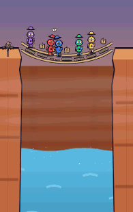

# 🌉 Die Hängebrücke

**Ein Trinkspiel über Anti-Koordination.** Ein Handy, 3–8 Personen, eine morsche Brücke
mit mehr Balken als Spielern — aber jeder Balken trägt nur eine Person. Zwanzig Sekunden
Absprache, dann wählt jeder geheim, dann treten alle gleichzeitig.

**Allein = sicher. Zu zweit = Sturz. Und jede friedliche Runde kostet die Brücke einen Balken.**

<p align="center">
  
</p>

Der Witz steckt in der letzten Zeile: Wer sich gut abspricht, kommt heil rüber — und
verliert dafür einen Balken. Nach ein paar friedlichen Runden gibt es weniger Balken als
Leute, und dann *muss* jemand fallen. Bis dahin sind Versprechen wertlos, aber verführerisch.

Schwesterprojekt von [Drinkshot](https://github.com/lukabpunkt/Drinkshot),
[Der Tresor](https://github.com/lukabpunkt/Tresor),
[Sprengmeister](https://github.com/lukabpunkt/Sprengmeister) und
[Der Zoll](https://github.com/lukabpunkt/Zoll) — gleicher Stack, gleiche Design-Sprache,
gleiche Charaktere.

**Status:** `v1.0.0-rc.1`. Alles gebaut, alles getestet — offen ist der Playtest
([`docs/PLAYTEST-01.md`](docs/PLAYTEST-01.md)). Erst danach wird daraus 1.0.

---

## So läuft eine Runde

| | |
|---|---|
| **1. Absprache** | 20 Sekunden reden. „Ich nehme die 3." Niemand muss sich daran halten. |
| **2. Wahl** | Das Handy geht reihum. Jeder tippt geheim einen Balken. Kein Zurück. |
| **3. Der Schritt** | Alle treten gleichzeitig. Jeder besetzte Balken knarrt — auch die sicheren. |
| **4. Die Rechnung** | Wer allein steht, verteilt Schlucke. Wer sich einen Balken teilt, trinkt und fällt. |
| **5. Die Brücke** | Kein Sturz? Ein Balken fault ab. Krach? Der Zimmermann repariert. |

**Fünf Modi** zum Dazuschalten: Fahne (öffentlich ansagen, Wortbruch wird teuer),
Morscher Balken (einer bricht auch unter einer Person), Schwergewicht (Rucksack 1–3),
Nebel (keine Absprache) und Seil (einmal pro Session sicher durchhangeln, für einen Schluck).

## Spielen

Als Web-App, ohne Installation und ohne Konto — **kein Backend, keine Analytics, keine
externen Requests**. Alles bleibt auf dem Gerät.

- **Live:** `https://lukabpunkt.github.io/Haengebruecke/` (nach dem ersten Deploy)
- **Als App:** im Browser-Menü „Zum Startbildschirm" — läuft danach offline im Vollbild.
- Am besten mit einem Handy, das herumgereicht wird. Desktop bekommt denselben
  Portrait-Rahmen, nicht die halbe Brücke im Breitbild.

## Selbst bauen

```
npm install
npm run dev              # Vite --host
npm test                 # typecheck + lint + unit (400 Tests)
npm run build            # tsc --noEmit + vite build + PWA
```

<details>
<summary>Alle Skripte</summary>

```
npm run test:coverage     # core/ >= 95 % (Audit A0)
npm run test:e2e          # Flow auf iPhone 12 (WebKit) + Pixel 5 (Chromium)
npm run test:perf         # JS-Budget, Draw-Batches, Long-Tasks (A2/A4/A5)
npm run balance -- 20000  # Kollisionsraten: Zufall, Absprache, Wortbruch, Sitzung (M6.2)
npm run build:atlas       # SVG → Atlas (world + chars)
npm run build:audio       # 32 Klänge synthetisieren und zum Sprite bauen
npm run preview:sequences # Sequenz-Preview (?dev=1&panel=sequences)
npm run capture:screens   # Bühnen-Screenshots für den Look-Check
npm run capture:falls     # fünf Momente je Fall-Sequenz
npm run capture:ui        # Titel-Loop, Absprache und Result
npm run capture:gif       # das animierte Bild oben (eigener GIF-Encoder, kein ffmpeg)
npm run check:colorblind  # Deuteranopie-Simulation auf dem Bühnenbild
```

`?dev=1` blendet das Dev-Panel ein (State, Balkenzahl, Todeszone erzwingen),
`?seed=123` macht Sequenzwahl und Bruch-Reihenfolge reproduzierbar,
`?dev=1&panel=sequences` zeigt jede Inszenierung auf Knopfdruck.

</details>

**Stack:** Vite 6 · TypeScript (strict) · PixiJS v8 · GSAP 3 · howler.js · vite-plugin-pwa
· Vitest · Playwright. Keine UI-Bibliothek, kein Framework: Die Menüs sind DOM, nur die
Schlucht ist PIXI — und die lädt erst, wenn sie gebraucht wird.

**Zahlen:** 400 Unit-Tests · 50 E2E auf zwei Engines · 235 KB JS gzip (davon 29 KB vor dem
ersten Tap) · ein Draw-Call auf der Bühne · Lighthouse Mobile 91 / 100 / 100.

## Dokumentation

| Dokument | Inhalt |
|---|---|
| [`docs/01-GDD.md`](docs/01-GDD.md) | Game Design — Brücke, Absprache, Wahl, Auszahlung, Schrumpfen, Modi, Inszenierungen |
| [`docs/02-ART-DIRECTION.md`](docs/02-ART-DIRECTION.md) | Art Direction — Canyon-Abenteuer, Tokens, Hikers, Geier, Zimmermann |
| [`docs/03-ARCHITECTURE.md`](docs/03-ARCHITECTURE.md) | Architektur — Stack, FSM, Datenmodell, Regelkern, Choreographer |
| [`docs/04-ROADMAP.md`](docs/04-ROADMAP.md) · [`docs/05-AUDITS.md`](docs/05-AUDITS.md) | Meilensteine M0–M6 · Audits A0–A6 |
| [`docs/PROGRESS.md`](docs/PROGRESS.md) | Fortschritt und alle Audit-Reports |
| [`docs/DECISIONS.md`](docs/DECISIONS.md) | 32 ADRs — warum es so ist und nicht anders |
| [`docs/PLAYTEST-01.md`](docs/PLAYTEST-01.md) · [`docs/DEVICE-MATRIX.md`](docs/DEVICE-MATRIX.md) | Playtest-Protokoll · Gerätematrix |
| [`CHANGELOG.md`](CHANGELOG.md) | Was in welcher Version dazukam |
| [`CLAUDE.md`](CLAUDE.md) | Arbeitsanweisungen für Claude Code |

## Lizenz

[MIT](LICENSE). Und der Hinweis, der nicht in der Lizenz steht: Es ist ein Trinkspiel.
Trinkt verantwortungsvoll — niemand muss mittrinken, um mitzuspielen.
